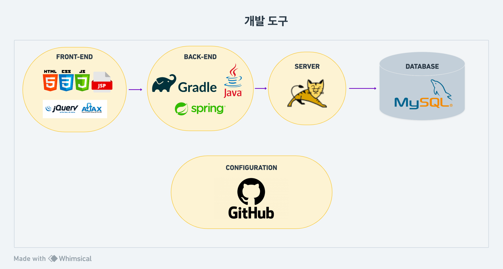

  

### 🖋 online-therapy

***

급격한 변화를 겪는 현대 사회의 청년들, 그동안 여러분은 어떻게 지내고 계셨나요?
  
빠르게 변화하는 이 시대에 불안정을 느껴 마음 먹고 막상 실제 정신과를 찾아가 대면으로 상담사를 만났을 때, 
공감하기 보단 딱딱한 해결책만 제시하고 약물 처방만 받았던 사례를 많이 봐왔으며 이 때문에 대면 상담을 받기에 부담스러운 청년들이 있습니다. 
이들을 위해 빠르게 발전해 나가는기술과 매개체를 이용해 도움을 주고자 기획하게 되었습니다.
  
`Bloom`은 오늘날 청년층의 독특하고 다양한 고민과 어려움을 같이 공감하고 헤쳐나가기 위해우리들의 정신건강을 지켜나갈 
온라인 상담 플랫폼을 제공합니다.
 이를 통해 여러분이 경험하지 못한 '누군가의 스토리'에 영향을 받고, 여러분의 스토리도 또한 다시 누군가에게 영향을 주는 커뮤니티를 형성하시게 됩니다.
 맞춤형 상담사 매칭으로 당신의 변화를 지원하여 `선택권의 폭을 넓혀, 다양한 상담사들과 매칭` 해드립니다.
  

### 🖋 Team LOGIN

***

## 이영현
* Github : https://github.com/babyybiss
* Role : Team Leader
* Positon : Full-Stack
* Stack : java, spring, mySql, TypeORM, Express, html, css
* Works :   figma를 이용한 페이지 디자인, 전반적인 페이지 디자인을 CSS를 사용하여 구현  spring framework, ajax, json, thymeleaf를 통해 회원가입, 로그인, 상담 예약 기능 구현, mybatis 이용하여 데이터베이스 연동, spring-security를 이용해 접근권한 제어 

## 이효진
* Github : https://github.com/Gray-Grazer
* Role : Team Member
* Positon : Full-Stack
* Stack : js, html, spring, mysql
* Works : 
커뮤니티 게시판 페이지 구현(CRUD), 고객센터 게시판 페이지 구현(CRUD), 후기 리스트 출력 페이지 

## 전승재
* Github : https://github.com/qkralsrl11
* Role : Team Leader
* Positon : Full-Stack
* Stack : Node.js, TypeScript, MySQL, TypeORM, Express
* Works :  
Post , Saved, Photo 구현, Multer를 사용하여 FORM-DATA(image) 처리, S3버킷을 이용한 이미지 저장,  OAuth를 사용하여 소셜 로그인 구현
EC2, 로드밸런서, route53, ACM을 사용하여 https 인증,  RDS를 이용한 데이터 관리 (Mysql 사용), EC2, S3, CloudFront를 이용한 배포

## 박지영
* Github : https://github.com/jiyeong08
* Role : Team Member
* Positon : Full-Stack
* Stack : Node.js, TypeScript, MySQL, TypeORM, Express
* Works :  회원 마이페이지 구현 관리자 페이지구현 mybatis를 이용하여 DB와 연동하고, spring framework, ajax, json, thymeleaf를 사용하여 회원의 개인정보와 활동정보 CRUD
 

 

### 🖋 development tools

***

### 🖋 More Info

***
[✈ Pointrip URL](https://pointrip.net) 

[👾 Wiki](https://github.com/hi-METAVIRTUAL/Bloom/wiki)

[🗓 회의록](https://github.com/codestates/Pointrip/projects/4)

[🐬 DB schema](https://github.com/codestates/Pointrip/wiki/DB-Schema)

[🐳 API 문서](https://github.com/codestates/Pointrip/wiki/API)

[📐 Wireframe](https://github.com/codestates/Pointrip/wiki/WireFrame)

[🎨 UI-Design](https://github.com/codestates/Pointrip/wiki/UI-Design)

[🛼 Work-Flow](https://github.com/codestates/Pointrip/wiki/WORK-FLOW)

